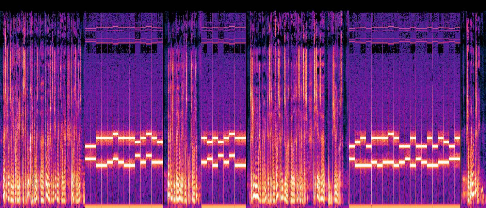

# Stego - rick_astley_tour
## Writeup Author: kebabulon

---

### Task

Я решил заказать билеты на шоу Рика Эстли. И даже сохранил аудиозвонок на случай, если мне не продадут билет!

**rick_astley_tour.mp3**

---

## Solution

It's an audio file. Lets check its spectrogram:



After doing a bit of research, this seems to be a T9 message:

```
77336C63306D65 68306D33 7231636B347374316579
```

Looks like hex:

```
w3lc0meh0m3r1ck4st1ey
```

And we get the flag.

---

### Flag

```
548CTF{w3lc0meh0m3r1ck4st1ey}
```
