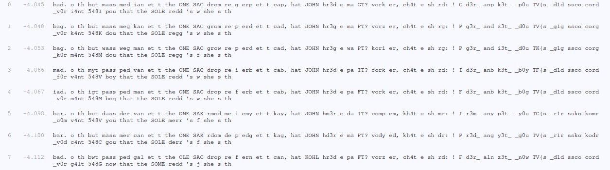

# Crypto - Scrambled Revenge
## Writeup Author: kebabulon

---

### Task
ОПЯТЬ Я УРОНИЛ ЛИСТОЧЕК В ШРЕДДЕР. y̴a̴ s̴k̴o̴r̴o̴ s̴o̴y̴d̴u̴ s̴ u̴m̴a̴...

**scrambled_revenge.zip**
```
-- scrambled.zip
   |-- what0.png
   |-- what1.png
   |-- what2.png
   |-- what3.png
   |-- what4.png
   |-- what5.png
   |-- what6.png
   |-- what7.png
   |-- what8.png
   |-- what9.png
   |-- what10.png
   |-- what11.png
   |-- what12.png
   |-- what13.png
   |-- what14.png
   |-- what15.png
   |-- what16.png
   |-- what17.png
   |-- what18.png
   |-- what19.png
   |-- what20.png
   |-- what21.png
   |-- what22.png
   |-- what23.png
   |-- what24.png
   |-- what25.png
   |-- what26.png
   |-- what27.png
   |-- what28.png
   |-- what29.png
   |-- what30.png
   |-- what31.png
   |-- what32.png
   |-- what33.png
   |-- what34.png
   |-- what35.png
   |-- what36.png
   |-- what37.png
   |-- what38.png
   |-- what39.png
   |-- what40.png
   |-- what41.png
   |-- what42.png
   |-- what43.png
   |-- what44.png
   |-- what45.png
```

---

### Solution

Just like the non-revenge task, we have a bunch of images with text on them:
```
apw.
h nu
aqn 
ipmm
iow 
spg 
on n
 nuo
HGO 
MPV 
wkhi
ko e
oky 
on n
vpy,
upn 
LHUG
uk3w
o ip
EN? 
rhkd
ok, 
vu4n
o mu
kw: 
! E 
w3k_
 pgy
d3n_
_y0q
NR{m
_w1w
mmvh
vhkw
_r0k
s4gn
548S
yhq 
nupn
nuo 
MHFO
koww
'm t
 muo
m nu
```

This looks like substitution, lets try https://quipqiup.com/ !



... That didn't help because all the text is scrambled up!  
I guess I'll have to do it manually:
```
B##GIMNOP#RJSTEAUFCVHWD#Y#
```
```
bad.
o th
but 
pass
ped 
can 
et t
 the
ONE 
SAW 
drop
re i
ery 
et t
way,
hat 
JOHN
hr3d
e pa
IT? 
forg
er, 
wh4t
e sh
rd: 
! I 
d3r_
 any
g3t_
_y0u
TF{s
_d1d
sswo
word
_f0r
c4nt
548C
you 
that
the 
SOME
redd
's v
 she
s th
```

Alright, now all that's left to do is to unscramble the text:

```
SOMEONE SAW IT? JOHN! I dropped the password sheet to the shredder, can you forget that but that's very bad. anyway, there is the password: 548CTF{shr3dd3r_c4nt_f0rg3t_wh4t_y0u_d1d
```

Hmmm... No closing bracket? Heh.

---

### Flag

```
548CTF{shr3dd3r_c4nt_f0rg3t_wh4t_y0u_d1d}
```
