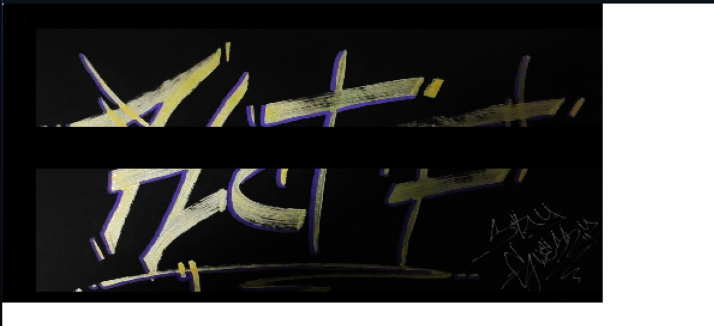
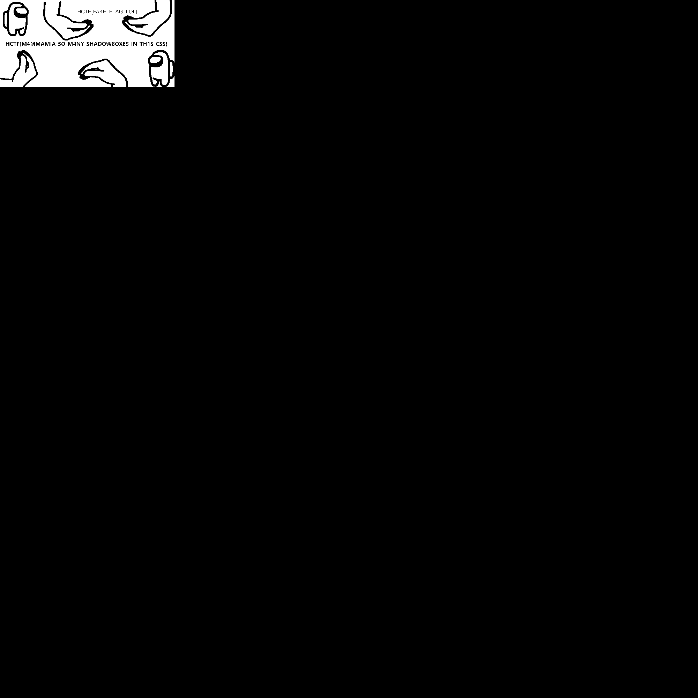
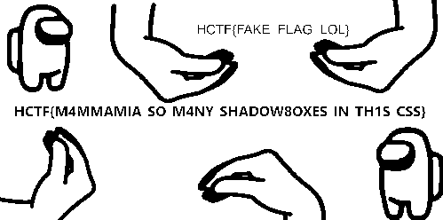

# Misc - Ghost Image
## Writeup Author: kebabulon

---

### Task

*The ctf ended, forgot to save the task lol*

https://ghost.hackappatoi.com/



---

### Solution

My browser crashed when I tried to open the website.  

Instead I cURL'd it (check **index.html**)

```html
<!DOCTYPE html>
<html lang="en">
<head>
	<link rel="icon" type="image/x-icon" href="/favicon.ico">
	<title>Ghost Image</title>
</head>
<body>
<div class="flag"></div>
<style>.notFlag{height:2px;width:2px;position:absolute;top:0px;left:0px;box-shadow: 0px 0px #000000,  0px 0px white,  2px 0px #000000,  2px 0px white, ...
.flag{height:2px;width:2px;position:absolute;top:0px;left:0px;box-shadow: 0px 0px #000000,  2px 0px #000000,  4px 0px #000000,  6px 0px #000000, ...
</body>
</html>
```

The images are made out of CSS shadow boxes, and there seems to be 2 images.  
I'll write a parser to convert it into an actual image.

Using BeautifulSoup we will the inner html of ```<style>``` element:

```py
from bs4 import BeautifulSoup
soup = BeautifulSoup(data, "html.parser")

f = soup.find("style")
f = f.encode_contents().decode("utf-8") 
```

Put all the shadow boxes into an array:

```py
f = f.split("box-shadow: ")

f = f[1] # .notFlag
f = f.split("}")[0]

fs = f.split(",  ")
```

Go through all the shadow boxes and write to a 2d array:

```py
import numpy as np

def tohex(h):
    return tuple(int(h[i:i+2], 16) for i in (0, 2, 4))

a = np.zeros((2000,2000,3))

for i in range(len(fs)):
    d = fs[i]

    d = d.replace("px", "")
    d = d.replace("#", "")
    d = d.split(" ")

    d[0] = int(d[0])//2
    d[1] = int(d[1])//2

    if d[2] == "white":
        d[2] = [255, 255, 255]
    elif d[2] == "black":
        d[2] = [0, 0, 0]
    else:
        d[2] = tohex(d[2])

    a[d[1],d[0]] = d[2]
```

Save the image:

```py
a = a.astype(np.uint8)

from PIL import Image
im = Image.fromarray(a)
im.save("ghost_image.png")
```



Enhanced image:



---

### Flag

```
hctf{m4mmamia_so_m4ny_shadow8oxes_in_th1s_css} 
```
