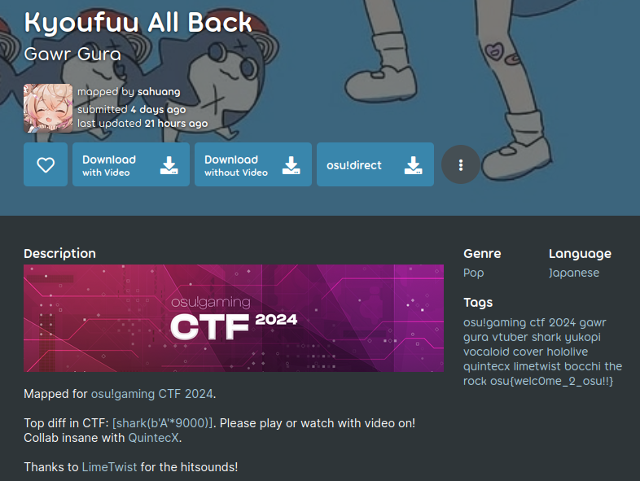

# osu - sanity-check-1
## Writeup Author: kebabulon

---

### Task

My first map in 2024: [Gawr Gura - Kyoufuu All Back](https://osu.ppy.sh/beatmapsets/2143550)

Mapped for osu!gaming CTF 2024. Please play/watch the top diff with video on!

To osu! players: CTF is a competition where participants attempt to find text strings, called "flags", which are secretly hidden in purposefully-vulnerable programs or websites. The strings can be in plain text, images, encoded/encrypted, etc.

In sanity-check-1, checkout map metadata and submit the flag you found. Remember flag is always in format osu{...} unless otherwise specified.

---

## Solution

Website:



And we already see the flag in the Tags.

---

### Flag

```
osu{welc0me_2_osu!!}
```

