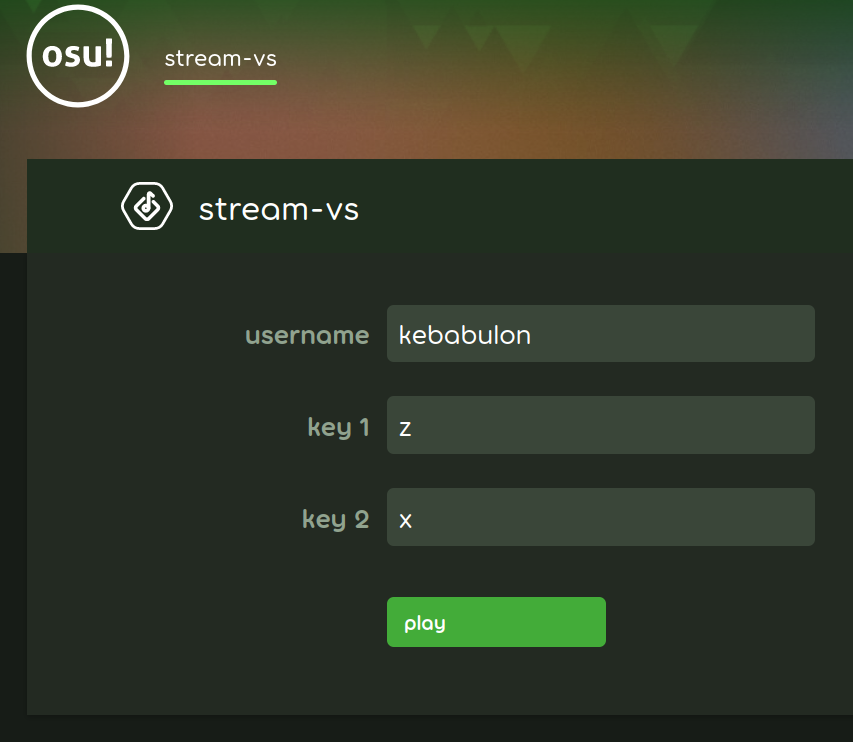
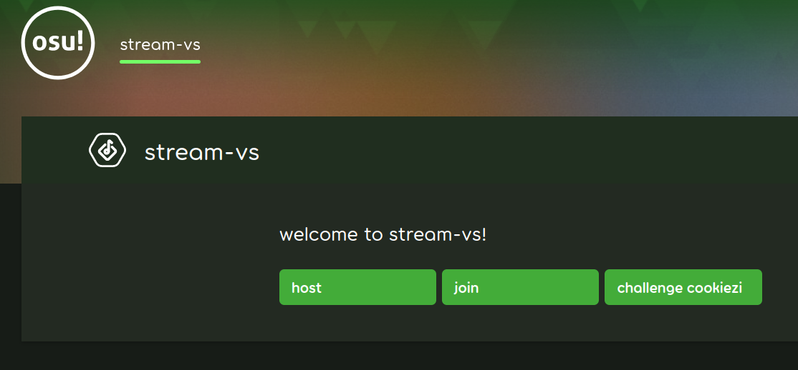
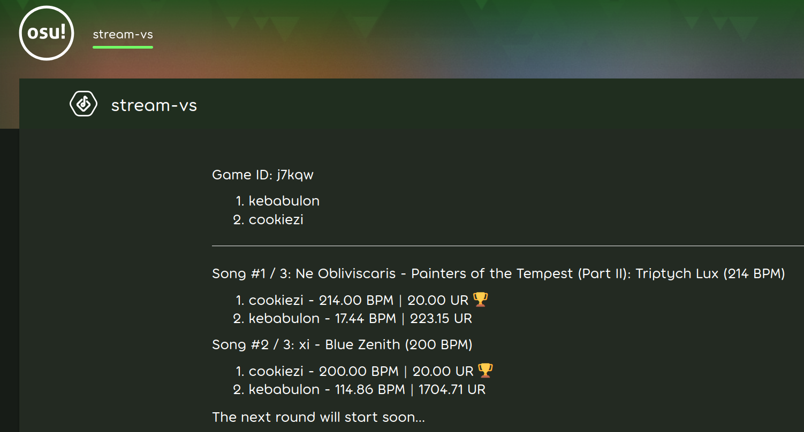

# web - stream-vs
## Writeup Author: kebabulon

---

### Task

how good are you at streaming? i made a site to find out! you can even play with friends, and challenge the goat himself

https://stream-vs.web.osugaming.lol/

---

## Solution

Website:






It's pretty obvious that to obtain the flag, you need to beat cookiezi...  
but he's too good! so let's figure out how to cheat.

Let's first look at the code:

**stream-vs.js**
```js
const $ = document.querySelector.bind(document);

const ws = new WebSocket(location.origin.replace("https://", "wss://").replace("http://", "ws://"));;
let username;
$("form").onsubmit = (e) => {
    e.preventDefault();
    username = $("[name='username']").value;
    ws.send(JSON.stringify({ type: "login", data: username }));
    localStorage.key1 = $("#key1").value;
    localStorage.key2 = $("#key2").value;
};

window.onload = () => {
    $("#key1").value = localStorage.key1 || "z";
    $("#key2").value = localStorage.key2 || "x";
};

$("#host-btn").onclick = () => {
    ws.send(JSON.stringify({ type: "host" }));
};

$("#challenge-btn").onclick = () => {
    ws.send(JSON.stringify({ type: "challenge" }));
};

$("#join-btn").onclick = () => {
    ws.send(JSON.stringify({ type: "join", data: prompt("Game ID:") }));
};

$("#start-btn").onclick = () => {
    $("#start-btn").style.display = "none";
    ws.send(JSON.stringify({ type: "start" }));
};

ws.onopen = () => {
    console.log("connected to ws!");
};

let session;
ws.onmessage = (e) => {
    const { type, data } = JSON.parse(e.data);
    if (type === "login") {
        $("form").style.display = "none";
        $("#menu").style.display = "block";

        const params = new URLSearchParams(location.search);
        if (params.has("id")) {
            ws.send(JSON.stringify({ type: "join", data: params.get("id") }));
        }
    }
    else if (type === "join") {
        session = data;
        $("#menu").style.display = "none";
        $("#lobby").style.display = "block";
        $("#gameId").innerText = `Game ID: ${session.gameId}`;
        $("#gameURL").innerText = location.origin + "/?id=" + session.gameId;
        $("#gameURL").href = "/?id=" + session.gameId;

        if (session.host === username) {
            $("#start-btn").style.display = "block";
        }

        $("#users").innerHTML = "";
        for (const user of session.users) {
            const li = document.createElement("li");
            li.innerText = user;
            $("#users").appendChild(li);
        }
    }
    else if (type === "game") {
        session = data;
        run(session);
    }
    else if (type === "results") {
        session = data;
        $("#results").innerHTML = "";
        $("#message").innerHTML = session.round < session.songs.length - 1 ? "The next round will start soon..." : "";
        $("#gameURL").parentElement.style.display = "none";
        for (let i = 0; i < session.results.length; i++) {
            const h5 = document.createElement("h5");
            h5.innerText = `Song #${i + 1} / ${session.songs.length}: ${session.songs[i].name} (${session.songs[i].bpm} BPM)`;
            $("#results").appendChild(h5);

            const ol = document.createElement("ol");
            for (let j = 0; j < session.results[i].length; j++) {
                const li = document.createElement("li");
                li.innerText = `${session.results[i][j].username} - ${session.results[i][j].bpm.toFixed(2)} BPM | ${session.results[i][j].ur.toFixed(2)} UR`;
                if (j === 0) li.innerText += " 🏆";
                ol.appendChild(li);
            }
            $("#results").appendChild(ol);
        }
    }
    else if (type === "message") {
        $("#message").innerText = data;
    }
    else if (type === "error") {
        alert(data);
    }
};

let clicks = new Set(), pressed = [], recording = false;
document.onkeydown = (e) => {
    if ((e.key === $("#key1").value || e.key == $("#key2").value) && recording && !pressed.includes(e.key)) {
        pressed.push(e.key);
        clicks.add(performance.now());
    }
};
document.onkeyup = (e) => {
    pressed = pressed.filter(p => p !== e.key);
}

const fadeOut = (audio) => {
    if (audio.volume > 0) {
        audio.volume -= .01;
        timer = setTimeout(fadeOut, 100, audio);
    }
}

// algorithm from https://ckrisirkc.github.io/osuStreamSpeed.js/newmain.js
const calculate = (start, end, clicks) => {
    const clickArr = [...clicks];
    const bpm = Math.round(((clickArr.length / (end - start) * 60000)/4) * 100) / 100;
    const deltas = [];
    for (let i = 0; i < clickArr.length - 1; i++) {
        deltas.push(clickArr[i + 1] - clickArr[i]);
    }
    const deltaAvg = deltas.reduce((a, b) => a + b, 0) / deltas.length;
    const variance = deltas.map(v => (v - deltaAvg) * (v - deltaAvg)).reduce((a, b) => a + b, 0);
    const stdev = Math.sqrt(variance / deltas.length);

    return { bpm: bpm || 0, ur: stdev * 10 || 0};
};

// scoring algorithm
// first judge by whoever has round(bpm) closest to target bpm, if there is a tie, judge by lower UR
/*
session.results[session.round] = session.results[session.round].sort((a, b) => {
    const bpmDeltaA = Math.abs(Math.round(a.bpm) - session.songs[session.round].bpm);
    const bpmDeltaB = Math.abs(Math.round(b.bpm) - session.songs[session.round].bpm);
    if (bpmDeltaA !== bpmDeltaB) return bpmDeltaA - bpmDeltaB;
    return a.ur - b.ur
});
*/

const sleep = ms => new Promise(r => setTimeout(r, ms));
const run = async (session) => {
    clicks.clear();
    $("#lobby").style.display = "none";
    $("#game").style.display = "block";
    $("#bpm").innerText = `BPM: 0`;
    $("#ur").innerText = `UR: 0`;

    $("#song").innerText = `Song #${session.round + 1} / ${session.songs.length}: ${session.songs[session.round].name} (${session.songs[session.round].bpm} BPM)`;
    const audio = new Audio(`songs/${session.songs[session.round].file}`);
    audio.volume = 0.1;
    audio.currentTime = session.songs[session.round].startOffset;
    await new Promise(r => audio.oncanplaythrough = r);

    for (let i = 5; i >= 1; i--) {
        $("#timer").innerText = `Song starting in ${i}...`;
        await sleep(1000);
    }

    const timer = setInterval(() => {
        $("#timer").innerText = `Time remaining: ${(session.songs[session.round].duration - (audio.currentTime - session.songs[session.round].startOffset)).toFixed(2)}s`
    }, 100);

    audio.play();
    // delay to start tapping
    await sleep(1000);
    let start = +new Date();
    recording = true;

    // delay to collect initial samples
    await sleep(500);
    while (audio.currentTime - session.songs[session.round].startOffset < session.songs[session.round].duration) {
        const { bpm, ur } = calculate(start, +new Date(), clicks);
        $("#bpm").innerText = `BPM: ${bpm.toFixed(2)}`;
        $("#ur").innerText = `UR: ${ur.toFixed(2)}`;
        await sleep(50);
    }

    let end = +new Date();
    recording = false;
    $("#timer").innerText = `Time remaining: 0s`;
    fadeOut(audio);
    clearInterval(timer);

    ws.send(JSON.stringify({ type: "results", data: { clicks: [...clicks], start, end } }));
    $("#message").innerText = "Waiting for others to finish...";
    $("#game").style.display = "none";
    $("#lobby").style.display = "block";
};
```

The game uses websockets to do networking. This line sends the player's clicks (timestamps) of the current song to the server:
```js
ws.send(JSON.stringify({ type: "results", data: { clicks: [...clicks], start, end } }));
```

Let's look at how the score is calculated:

```

```


---

### Flag

```
osu{welc0me_2_osu!!}
```


