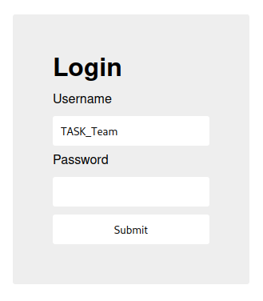

# Web - login
## Writeup Author: kebabulon

---

### Task
My dog-sitter's brother made this website but I can't get in; can you help?  
login.mars.picoctf.net



---

### Solution

Lets look at the source code:  

```html
<!doctype html>
<html>
    <head>
        <link rel="stylesheet" href="styles.css">
        <script src="index.js"></script>
    </head>
    <body>
        <div>
          <h1>Login</h1>
          <form method="POST">
            <label for="username">Username</label>
            <input name="username" type="text"/>
            <label for="username">Password</label>
            <input name="password" type="password"/>
            <input type="submit" value="Submit"/>
          </form>
        </div>
    </body>
</html>
```

A script? This is interesting...

**index.js**
```js
(async()=>{await new Promise((e=>window.addEventListener("load",e))),document.querySelector("form").addEventListener("submit",(e=>{e.preventDefault();const r={u:"input[name=username]",p:"input[name=password]"},t={};for(const e in r)t[e]=btoa(document.querySelector(r[e]).value).replace(/=/g,"");return"YWRtaW4"!==t.u?alert("Incorrect Username"):"cGljb0NURns1M3J2M3JfNTNydjNyXzUzcnYzcl81M3J2M3JfNTNydjNyfQ"!==t.p?alert("Incorrect Password"):void alert(`Correct Password! Your flag is ${atob(t.p)}.`)}))})();
```

This script is minimized, needs to be prettified:

```js
(async () => {
    await new Promise((e) => window.addEventListener("load", e)),
        document.querySelector("form").addEventListener("submit", (e) => {
		e.preventDefault();
		const r = { u: "input[name=username]", p: "input[name=password]" },
		    t = {};
		for (const e in r)
		    t[e] = btoa(document.querySelector(r[e]).value).replace(/=/g, "");
		return "YWRtaW4" !== t.u
		    ? alert("Incorrect Username")
		    : "cGljb0NURns1M3J2M3JfNTNydjNyXzUzcnYzcl81M3J2M3JfNTNydjNyfQ" !== t.p
		      ? alert("Incorrect Password")
		      : void alert(`Correct Password! Your flag is ${atob(t.p)}.`);
    });
})();
```

The flag is ```atob(t.p)```  
And ```atob(t.p)``` is just a base64 decode of ```t.p```  
... And for the password to be correct, ```t.p``` needs to be:  
```"cGljb0NURns1M3J2M3JfNTNydjNyXzUzcnYzcl81M3J2M3JfNTNydjNyfQ"```

So, the flag is just base64 decode of line above. Thats the flag.

---

### Flag

```
picoCTF{53rv3r_53rv3r_53rv3r_53rv3r_53rv3r}
```
